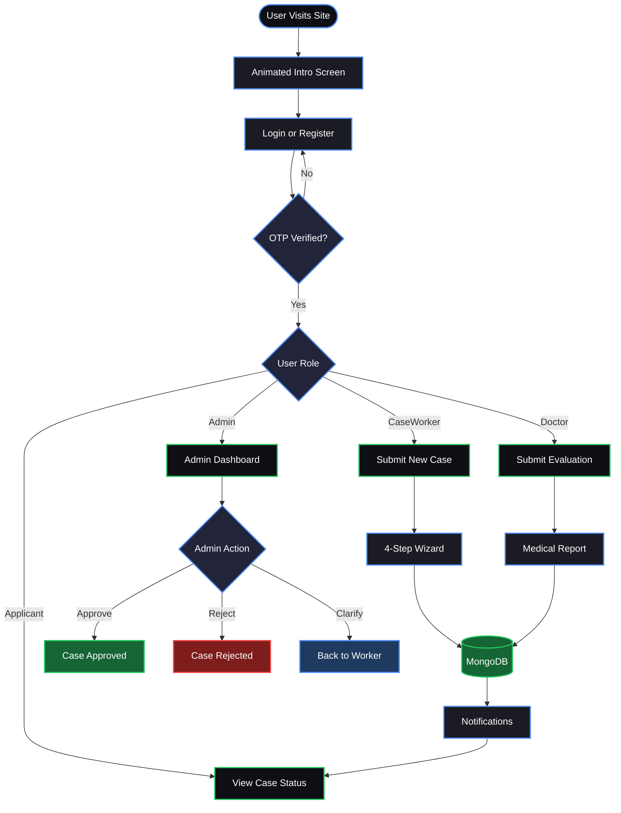
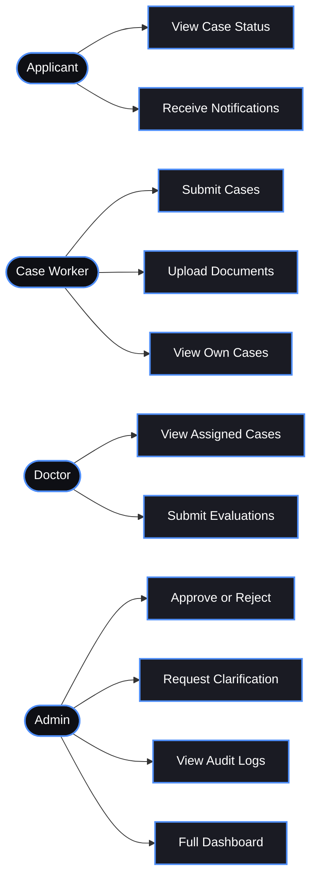
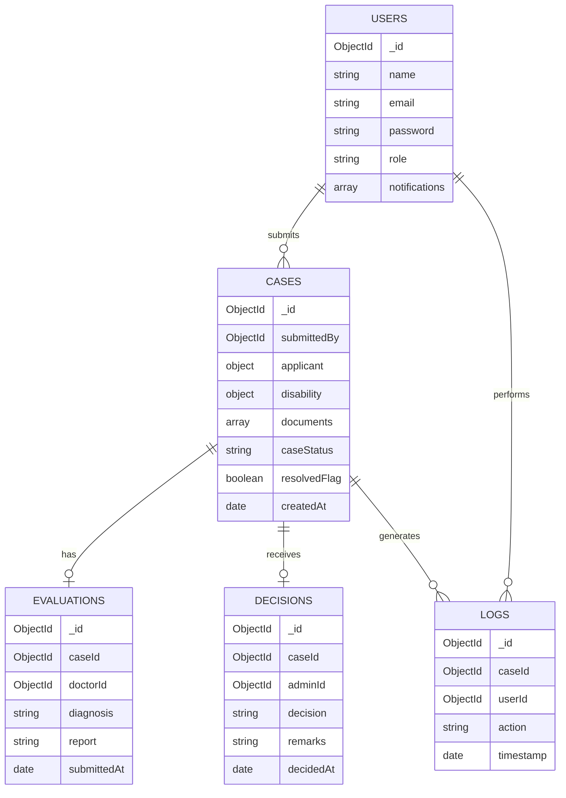
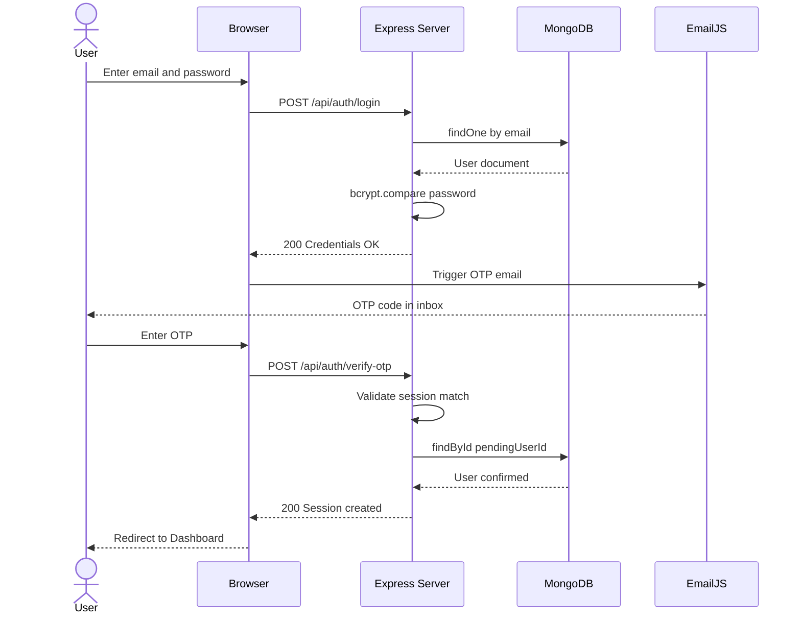
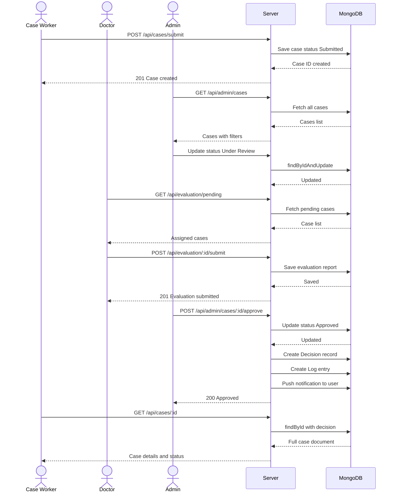
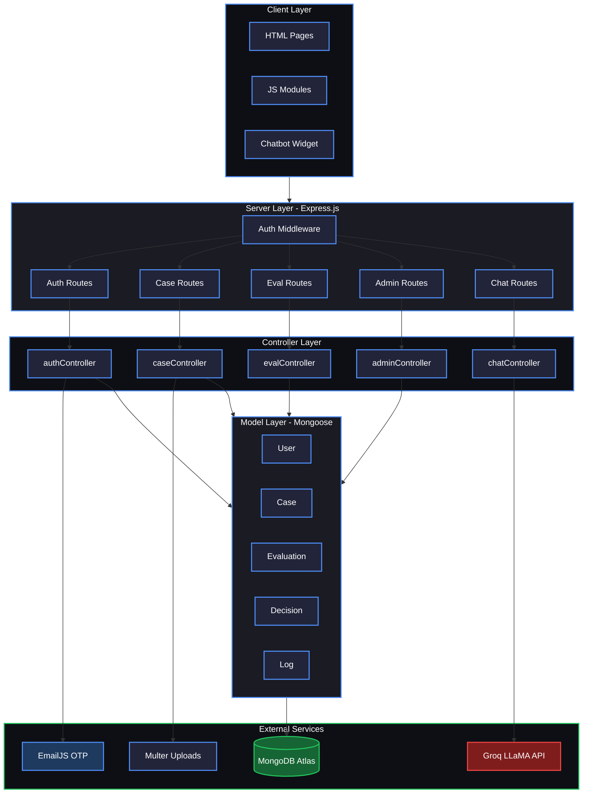
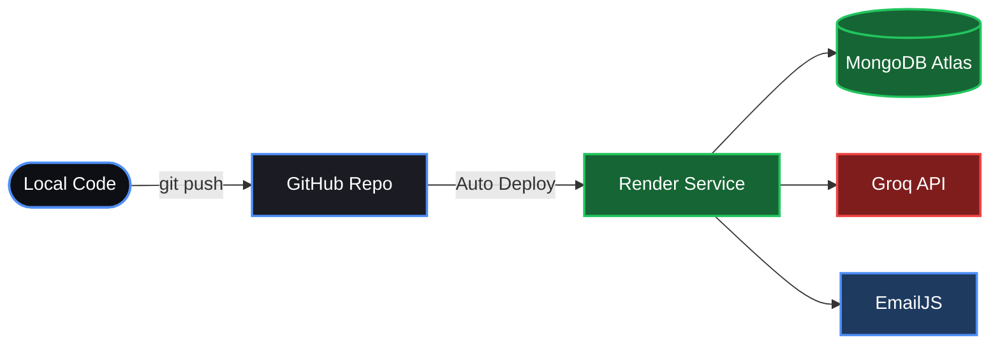

<div align="center">


<br/>


<br/>

> **Aariva** is a full-stack web application that manages the end-to-end lifecycle of disability cases — from submission and medical evaluation to admin decisions and live status tracking.

<br/>

[](https://aariva.onrender.com)

</div>

---

## 🗂️ Project Structure

```
aariva/
├── client/
│   ├── assets/
│   │   ├── css/style.css
│   │   └── js/
│   │       ├── auth.js          ← Login, OTP flow, register
│   │       ├── case.js          ← Case submission, tracking, print
│   │       ├── dashboard.js     ← Case worker dashboard
│   │       ├── chatbot.js       ← Floating AI assistant widget
│   │       └── utils.js         ← API helper, auth guard, notifications
│   └── pages/
│       ├── intro.html           ← Animated splash screen
│       ├── login.html
│       ├── register.html
│       ├── dashboard.html
│       ├── submit-case.html
│       ├── track-case.html
│       ├── evaluation.html
│       └── admin.html
├── server/
│   ├── controllers/
│   ├── middleware/
│   ├── models/
│   ├── routes/
│   └── app.js
├── uploads/
├── .env
└── package.json
```

---

## ✨ Features

| # | Feature | Description |
|---|---------|-------------|
| 1 | **Role-Based Access** | Applicant · Case Worker · Doctor · Admin |
| 2 | **OTP Two-Factor Auth** | Email OTP via EmailJS, 5-min expiry |
| 3 | **Case Submission Wizard** | 4-step form with drag & drop upload |
| 4 | **Live Status Tracking** | Timeline: Submitted → Verified → Evaluated → Decision |
| 5 | **Medical Evaluations** | Doctors submit diagnosis reports per case |
| 6 | **Admin Dashboard** | Filter, approve, reject, clarify cases |
| 7 | **AI Chat Assistant** | Floating Aari bot powered by Groq LLaMA |
| 8 | **Audit Logs** | Every action timestamped and logged |
| 9 | **Auto Escalation** | Cases pending 7+ days are auto-flagged |
| 10 | **Animated Intro Screen** | Cinematic splash with particles on load |

---

## 🔄 System Flow



---

## 👥 Role Access Map



---

## 🗄️ Database Schema



---

## 🔌 API Reference

| Method | Route | Access | Description |
|--------|-------|--------|-------------|
| POST | `/api/auth/register` | Public | Register new user |
| POST | `/api/auth/login` | Public | Validate credentials, send OTP |
| POST | `/api/auth/verify-otp` | Public | Finalize session |
| GET | `/api/auth/me` | Protected | Get current user |
| POST | `/api/auth/logout` | Protected | Destroy session |
| POST | `/api/cases/submit` | Case Worker | Submit new case |
| GET | `/api/cases/my-cases` | Case Worker | List own cases |
| GET | `/api/cases/:id` | Protected | Get case detail |
| GET | `/api/cases/track/:id` | Public | Track case status |
| GET | `/api/admin/cases` | Admin | All cases with filters |
| POST | `/api/admin/cases/:id/approve` | Admin | Approve with remarks |
| POST | `/api/admin/cases/:id/reject` | Admin | Reject with remarks |
| POST | `/api/admin/cases/:id/clarify` | Admin | Request clarification |
| GET | `/api/admin/logs` | Admin | Full audit log |
| POST | `/api/evaluation/:id/submit` | Doctor | Submit evaluation |
| GET | `/api/evaluation/pending` | Doctor | Pending evaluations |
| POST | `/api/chat` | Protected | AI chat via Groq |

---

## 🔁 Login Sequence



---

## 📋 Case Lifecycle Sequence



---

## 🏗️ System Architecture



---

## ⚙️ Getting Started

### Prerequisites
- Node.js v18+
- MongoDB Atlas account
- EmailJS account (free — 200 emails/month)
- Groq API key (free)

### Installation

```bash
git clone https://github.com/your-username/aariva.git
cd aariva
npm install
```

### Environment Variables

```env
PORT=5000
MONGO_URI=your_mongodb_atlas_connection_string
SESSION_SECRET=your_secret_key
GROQ_API_KEY=your_groq_api_key
```

### EmailJS Setup

Create `client/assets/js/config.js` and add to `.gitignore`:

```javascript
const EMAILJS_CONFIG = {
  publicKey:  'your_public_key',
  serviceId:  'your_service_id',
  templateId: 'your_template_id'
};
```

### Run

```bash
npm start
# Visit http://localhost:5000
```

---

## 🚀 Deploy to Render



| Setting | Value |
|---------|-------|
| Runtime | Node |
| Build Command | `npm install` |
| Start Command | `node server/app.js` |
| Plan | Free |

Add in Render Environment tab: `MONGO_URI` · `SESSION_SECRET` · `GROQ_API_KEY` · `NODE_ENV=production`

---

<div align="center">

**Developed by [Siddharth Kumar](https://siddharthkumar.tech)**

*VIT Vellore · Full Stack Developer · MERN Stack*


</div>
